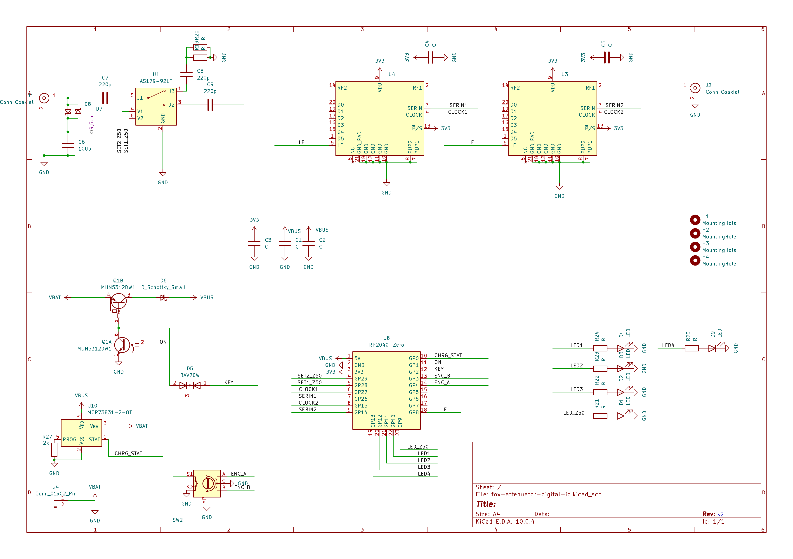
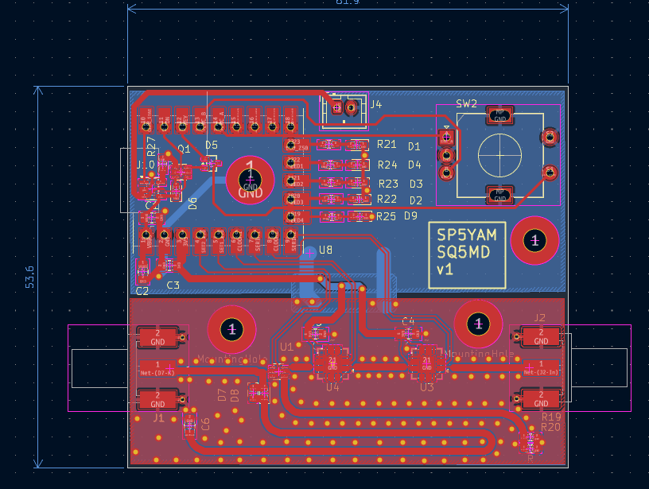
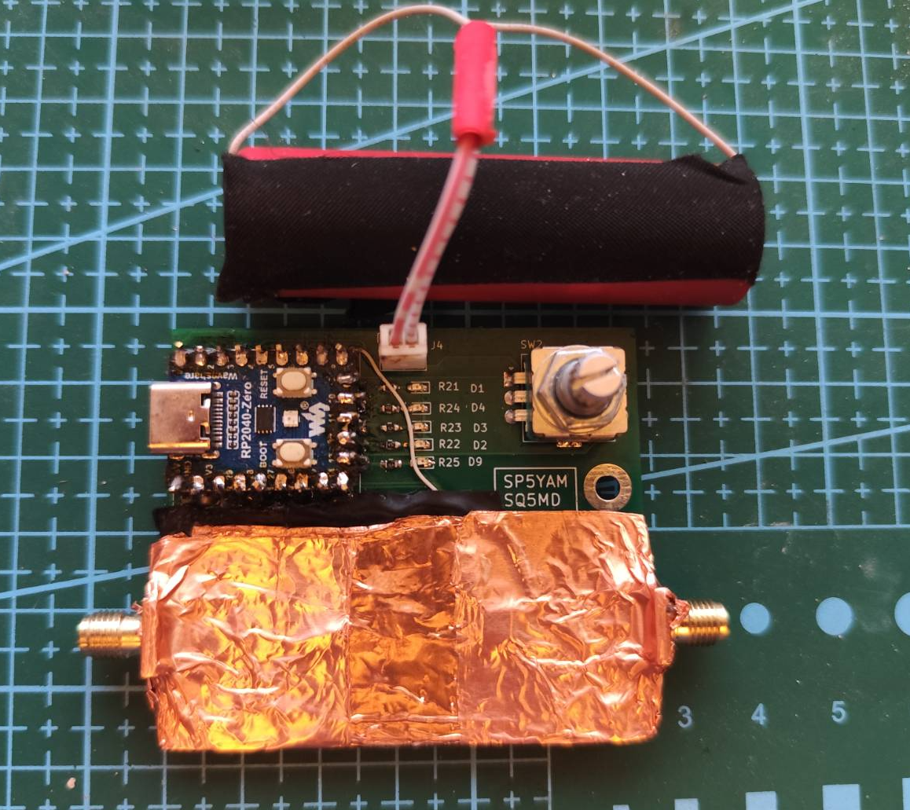
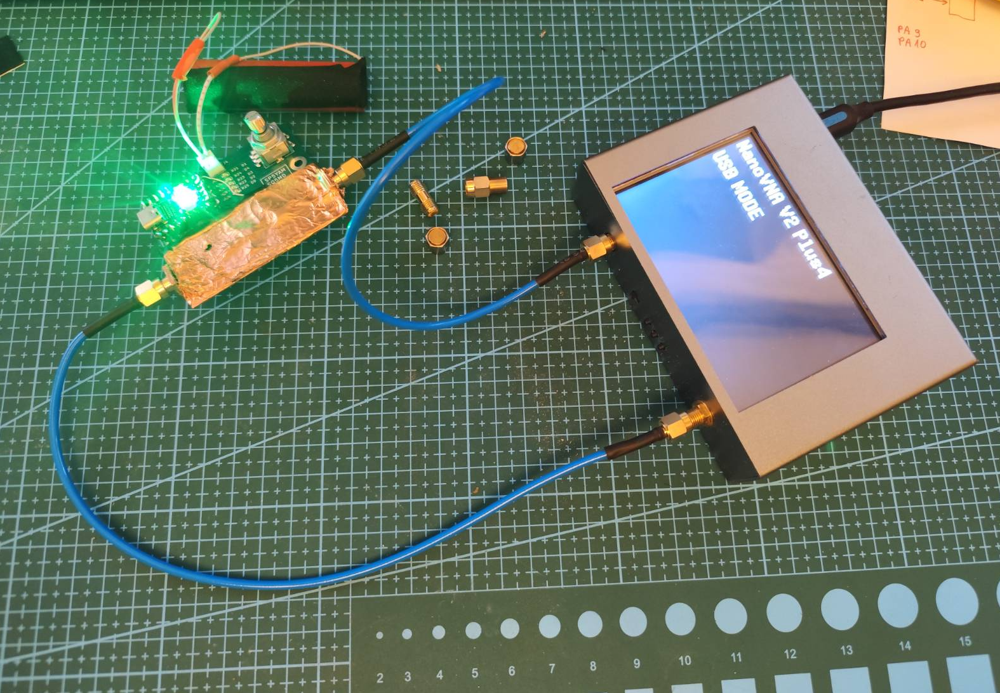
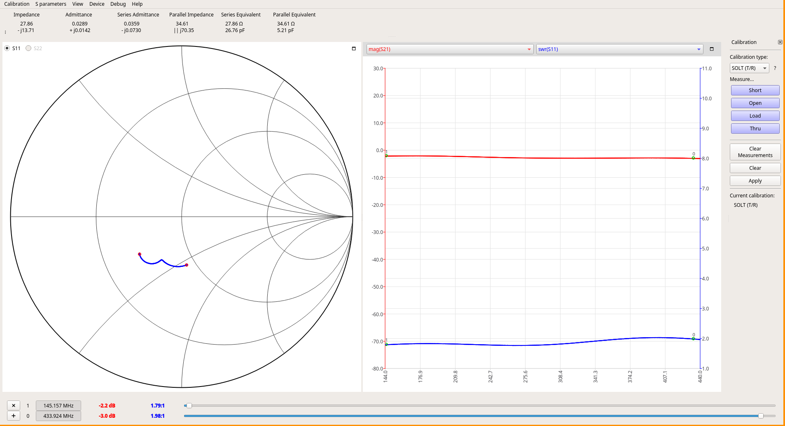
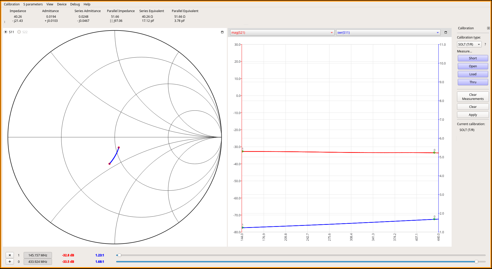
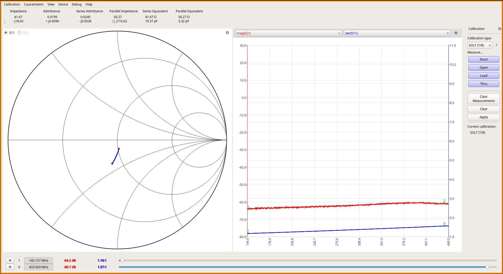
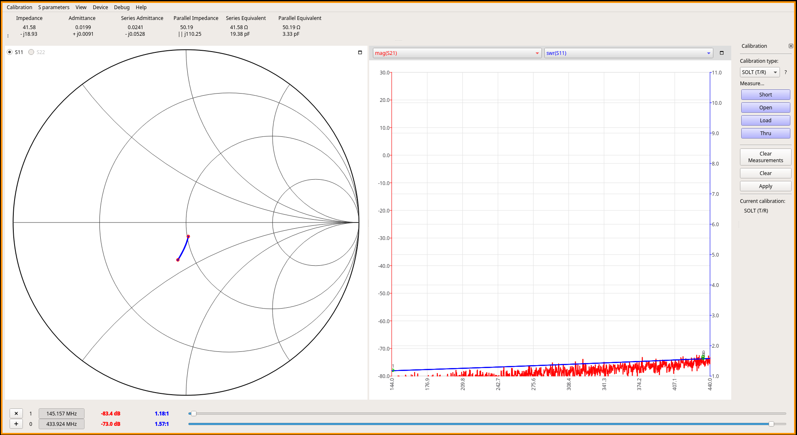
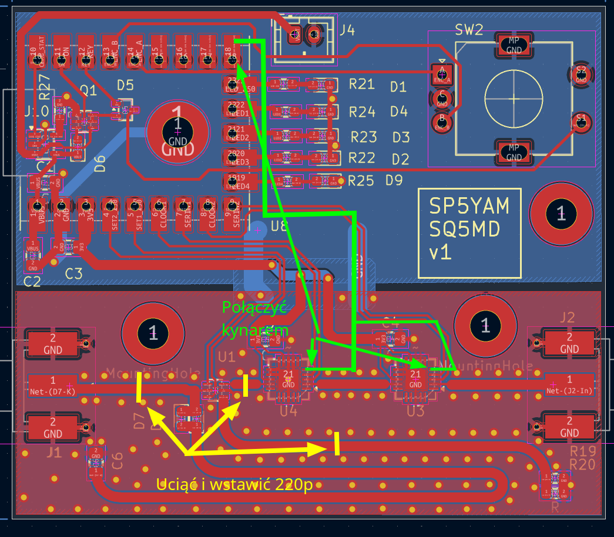

# Tłumik odbiorczy do łowów na lisa 
Przedmiotem opisu jest urządzenie do tłumienia sygnału pochodzącego z anteny w celu umożliwienia kierunkowego namierzania bliskich urządzeń nadawczych małej mocy takich jak np. nadajniki do łowów na lisa.

Projekt powstał jako potrzeba klubowa SP5YAM z Komorowa.

Autorzy:

Elektronika + oprogramowanie: **Marcin SQ5MD**

Obudowa: **Michał SP5LEL**

Konsultacje: **Klub SP5YAM**

## Zanim zbudujesz

Zanim zbudujesz, miej na uwadze że PCB v1 zawiera błędy i wymaga **cięcia ścieżek**, dolutowania 3 elementów oraz **poprowadzenia 2 cienkich kynarów do układu QFN**.

Projekt PCB v2 w toku.

## Opis głównych funkcji:

- 2 złącza SMA, jedno do podłączenia anteny, drugie do podłączenia odbiornika.
- Zasilanie z 1 ogniwa 18650
- Wbudowana ładowarka 500mA (USB C)
- Sygnalizacja naładowania na diodzie RGB
- Sygnalizacja tłumienia na diodzie RGB oraz na pasku 5xLED
- Interfejs użytkownika - enkoder kwadraturowy (12 imp na obrót) z przyciskiem
- Tłumienie teoretyczne 0-63dB z krokiem co 0,5dB
- Bypass antenowy 50Ω - do namierzania bez kierunku z bardzo bliskiej odległości
- Tłumienie zmierzone: 2.2-64.2dB (bypass do 80dB)
- Auto Power Off po określonym czasie nieaktywności
- Dioda RGB

## Obsługa

Urządzenie po włączeniu jest od razu gotowe do pracy sygnalizując to zaświeceniem diody LED na zielono.
Kręcenie enkoderem powoduje odpowiednio zwiększenie lub zmniejszenie tłumienia z krokiem 0.5dB. 

Stan tłumienia sygnalizowany jest diodą RGB:
- Intensywny zielony - brak tłumienia
- Zielony-poprzez żółty, pomarańczowy, czerwony - aktywne tłumienie w zależności od koloru LED
- Intensywny czerwony - tłumienie maksymalne
- Niebieski - stan odcięcia anteny. Bypass Z=50Ω.

Urządzenie włączamy i wyłączamy przyciskiem na enkoderze.

Urządzenie posiada wbudowaną ładowarkę (MCP73831), a stan naładowania sygnalizowany jest kolorem fioletowym.

Projekt można przetestować na stoisku SP5YAM w Burzeninie 2026 podczas zabawy w łowy na lisa. Dostępne są 2 sztuki.

## Konstrukcja

Tor antenowy układu składa się z poszczególnych elementów (kolejność od strony podłączania odbiornika):
- Złącze SMA (żeńskie)
- RF-Switch AS179 (rozdziela tor odbiorczy na tor antenowy i bypass Z=50Ω)
	- Do anteny: 2 x cyfrowy tłumik regulowany Berex BDA4601 sterowany z mikrokontrolera
	- Bypass: Rezystancja Z=50Ω, pomija oba tłumiki.

 Układ sterowany jest z mikrokontrolera RP2040 (płyta RP2040-Zero od Waveshare https://www.waveshare.com/wiki/RP2040-Zero )

Interfejs użytkownika stanowi enkoder kwadraturowy z przyciskiem, 5 diod LED, dioda LED RGB.

Urządzenie jest zasilane z jednego ogniwa Li-Ion 18650, oraz posiada wbudowaną ładowarkę MCP73831.

Elementy Q1 i D5 pozwalają zrealizować funkcję programowego wyłączenia urządzenia..

 
### Schemat

### PCB

Płytka drukowana wykonana została w technologii 2 warstwowej na laminacie FR4 o grubości 0.6mm aby zapewnić najlepsze dopasowanie do impedancji 50Ω.

### Oprogramowanie

#### Moduły

Oprogramowanie układu oparte jest o projekt Zephyr, co przyspieszyło stworzenie projektu. Modułowa konstrukcja oprogramowania pozawala utrzymać porządek i lepiej zrozumieć budowę układu. W układzie można wydzielić kilka głównych modułów które komunikują się ze sobą za pomocą wiadomości wysyłanych przez magistralę EventBus.  
Magistrala EventBus pozwala każdemu z modułów na subskrypcję poszczególnych rodzajów eventów (model Publish/Subscribe).

##### Moduł InputListener

Moduł odpowiada za odpowiedni odczyt eventów z systemu Zephyr i ich wysłanie na magistralę eventów EventBus.
Eventy które wysyła to:
- EncoderRotated(lewo/prawo) - (gdy wykryto przekręcenie enkodera w lewo lub prawo)
- EncoderPressEvent(wciśnięcie/puszczenie) - gdy wyrkryto wciśnięcie lub puszczenie przycisku
- ChargerEvent - gdy wykryto stan naładowania z ładowarki
##### Moduł logiki aplikacji

Obsługuje wiadomości:
- EncoderRotated - wysłanie eventu AttenuatorChange
- EncoderPressEvent - wysłanie eventu PowerOff
- ChargerEvent - wysłanie eventu RgbLedSet()
- AttenuationInfo - wysłanie eventu RgbLedSet oraz LedMatrixSet w zależności od wartości tłumienia

##### Moduł HW
Obsługuje wiadomości:
- LedMatrixSet - ustawienie stanu na diodach 5xLED
- PowerOff - wyłączenie układu
- RgbLedSet - ustawienie odpowiedniego koloru na diodzie RGB
- ApplyAttenuatorChange - zmiana tłumienia (lub bypass)

#### Bootloader
Mikrokontroler posiada wbudowany bootloader.
Aktualizacja oprogramowania jest możliwa za pomocą przewodu USB-C.
Jest to standardowy bootloader wbudowany w mikrokontroler RP2040.

### Obudowa

Do układu powstała obudowa wykonana w technologii druku 3D FDM, autorem obudowy jest Michał SP5LEL.
Na moment pisania tej treści nie ma dostępnych fotografii obudowy.

### Fotografie

## Pomiary

Urządzenie pomiarowe:
NanoVNA V2 od NanoRFE (https://nanorfe.com/pl/)
Aplikacja:
VNA_View na Linux

Parametry pomiarowe:
Sweep 144-440MHz, 1024 punkty, AVG=5
kalibracja SOLT

### Minimalne tłumienie

### Połowa skali

### Maksymalne tłumienie

### Bypass

Tor bypassu jest najbardziej wrażliwy na ekranowanie urządzenia.

## TODO:

- [ ] Poprawki PCB: brak sygnału LE, brak DC-blockerów RF
- [ ] Diody LED THT zamiast SMD
- [ ] Tylko jeden tłumik regulowany, drugi stały 30dB
- [ ] Wymiana ładowarki jest bardzo trudna - montować układ inaczej
- [ ] Integracja z odbiornikiem (żeby nie trzeba było podłączać zewnętrznego odbiornika)
- [ ] Dodać pomiar napięcia baterii
- [ ] Wrzucić do releases plik uf2

## Przeróbka PCB v1 aby działała

## Edytor schematów i pcb

Stworzone w Kicad 10.0.4

## Jak skompilować

1. Zainstaluj Zephyra: https://docs.zephyrproject.org/latest/develop/getting_started/index.html
2. Zainstaluj i skonfiguruj CLion: https://docs.zephyrproject.org/latest/develop/tools/clion.html
3. Otwórz projekt in CLion, otwórz folder w którym znajduje się główny plik CMakeLists.txt (w momencie pisania tej treści jest to folder 'software/fox-attenuator')
4. Uruchom płytkę RP2040-Zero w trybie bootloadera a następnie wybierz target "flash" w CLion i uruchom budowanie projektu.

